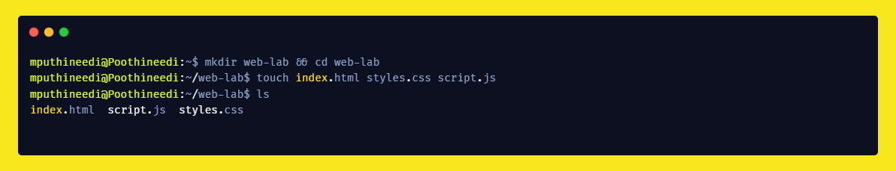
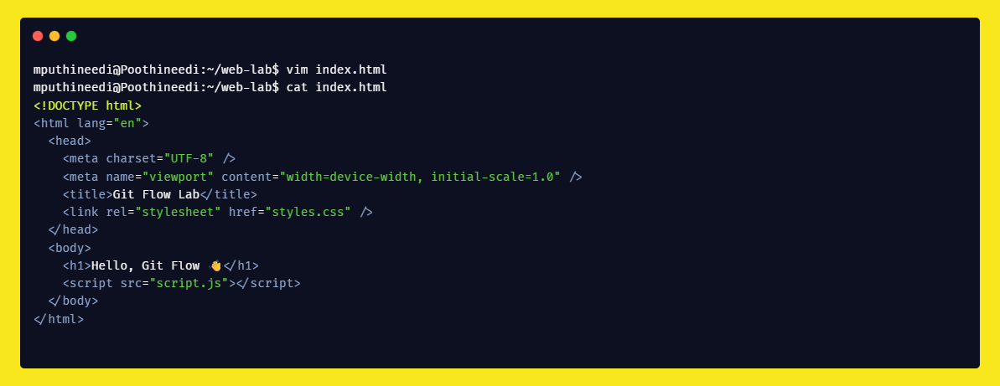
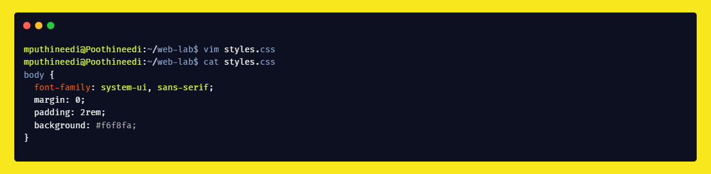
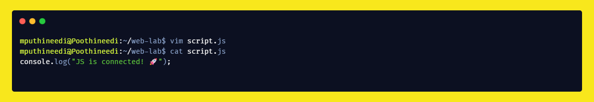
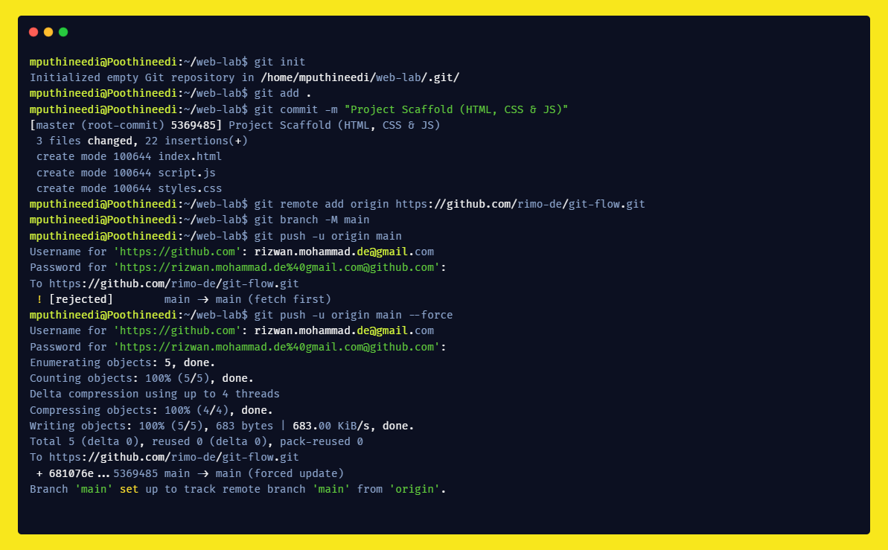
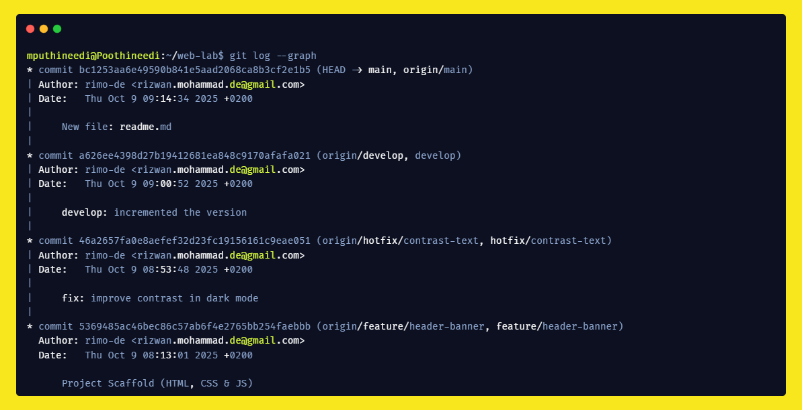

# 🧠 Git Flow Lab

This project demonstrates how to use **Git Flow** effectively for version control and team collaboration.

---

## 💡 What Problem Does Git Flow Solve?

Git Flow helps teams manage code changes across different stages of development.  
It provides a clear branching strategy, separating:
- **`main`** for production-ready code  
- **`develop`** for ongoing work  
- **feature**, **release**, and **hotfix** branches for controlled updates  

✅ This avoids messy merges and keeps releases stable while allowing parallel work.

---

## ⚙️ Commands I Learned

1. `git init` – initialize a local repository  
2. `git add .` – stage changes  
3. `git commit -m "message"` – save changes with a message  
4. `git push origin main` – push commits to the remote repo  
5. `git checkout <branch>` – switch branches  
6. `git checkout -b <branch>` – create a new branch  
7. `git push -u origin main` – set upstream branch  
8. `git merge` – combine changes between branches  
9. `mkdir` – create directory  
10. `touch` – create new files  
11. `vim` / `cat` – edit or view file content in CLI  
12. `code .` – open the current directory in VS Code  

---

## 🧩 What I Did

- Created a local repo using Git CLI  
- Added `index.html`, `styles.css`, and `script.js`  
- Practiced branching, merging, and resolving conflicts  
- Created and pushed a `README.md` file directly from CLI  

---

## 💪 Most Useful Command

`git merge` — It helped me understand how branches combine and how conflicts occur, which is key for teamwork and production stability.

---

## 🖼️ Screenshots

Below are screenshots from my Git Flow lab session:

---

### ✍️ Author
**Rimo-de (Mohammad Rizwan)**  
_Practicing Git Flow, branching, and collaboration workflow_
